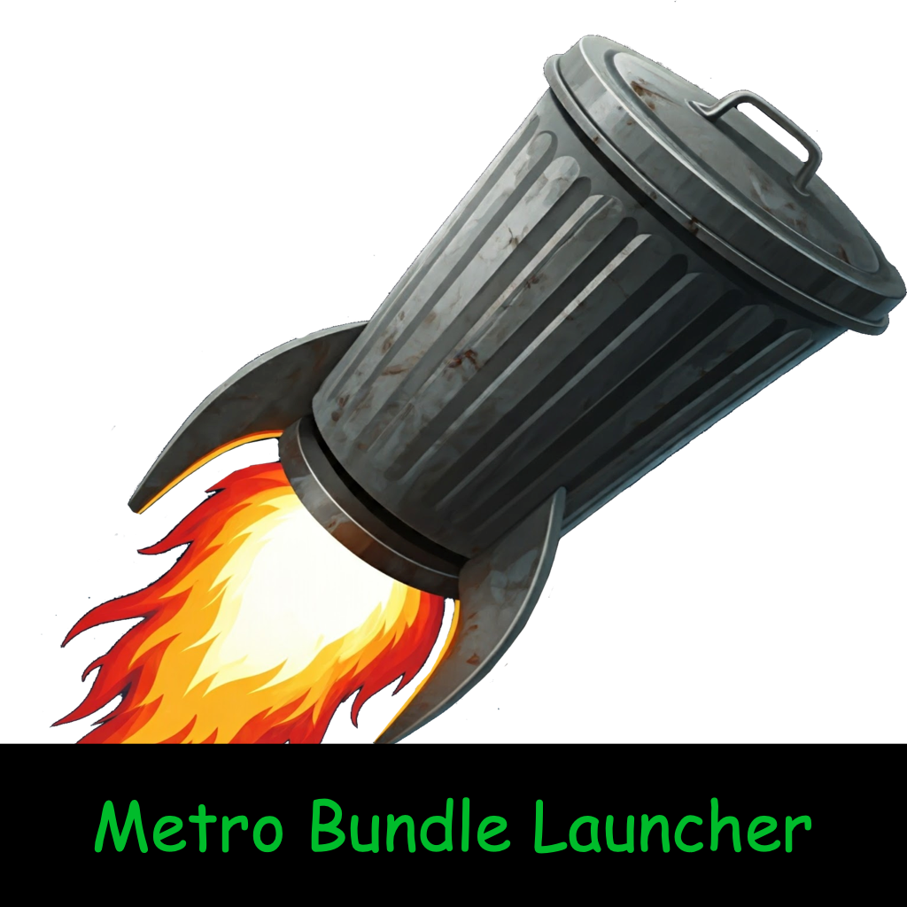

<p align="center">
    
</p>

[](https://github.com/ncorgan/metro_launcher/blob/master/LICENSE.txt) [](https://github.com/savaughn/metro_launcher/releases) [](https://github.com/savaughn/metro_launcher/actions) [](https://github.com/savaughn/metro_launcher/issues) [](https://github.com/savaughn/metro_launcher/releases)

Metro Bundler Launcher is a GTK4-based application designed to manage the Metro Bundler for React Native projects.

<p align="center">


</p>

## Using Metro Bundler Launcher
This requires the minimum React Native development environment to be set up. 

### Installation
#### install homebrew 
  ```sh
  bin/bash -c "$(curl -fsSL https://raw.githubusercontent.com/Homebrew/install/HEAD/install.sh)"
  ```
#### install node
    brew install node

#### download and install latest release of metro_launcher
Get the latest release from [release page](github.com/savaughn/metro_launcher/releases). Open the installer dmg and move the app to Applications folder. Right click and open the app on first launch to bypass security settings.

### Usage
- `working directory`: Input a project directory path in the text field labeled "project root".
- `Enviromental Variables`: Input any environment variables in the text field labeled "env vars" such as "ENV=development". These will be appended to the metro command.
- `Port`: Input a port number in the text field labeled "port". This will be used to start the metro bundler on the specified port.
- `Debugger`: Enable the hermes debugger by checking the checkbox labeled "Enable Hermes Debugger".
- `Status Light`: The status light will change color based on the status of the metro bundler. Green indicates the metro bundler is running, red indicates the metro bundler is not running on the specified port.

- `Buttons`:
    - `Play`: Start the metro bundler.
    - `Stop`: Stop the metro bundler.
    - `Restart`: Restart the metro bundler.
    - `Dark Mode`: (lightbulb) Toggle dark mode.


## Contributing

### Prerequisites

- GTK4
- GCC
- macOS (for setup script)

### Setup for MacOS

1. **Clone the repository**:
    ```sh
    git clone https://github.com/savaughn/metro_launcher.git 
    cd metro_launcher
    ```

2. **Install dependencies**:
    ```sh
    ./setup_macos.sh
    ```

3. **Build the project**:
    ```sh
    make
    ```

4. **Run the application**:
    ```sh
    make run
    ```

### Makefile

The `Makefile` includes targets for building and running the project:
- `make`: Builds the project.
- `make run`: Runs the built executable.
- `make clean`: Cleans up the build artifacts.

## Contributing
 - Fork and PR, please.

## License

This project is licensed under the MIT License.
